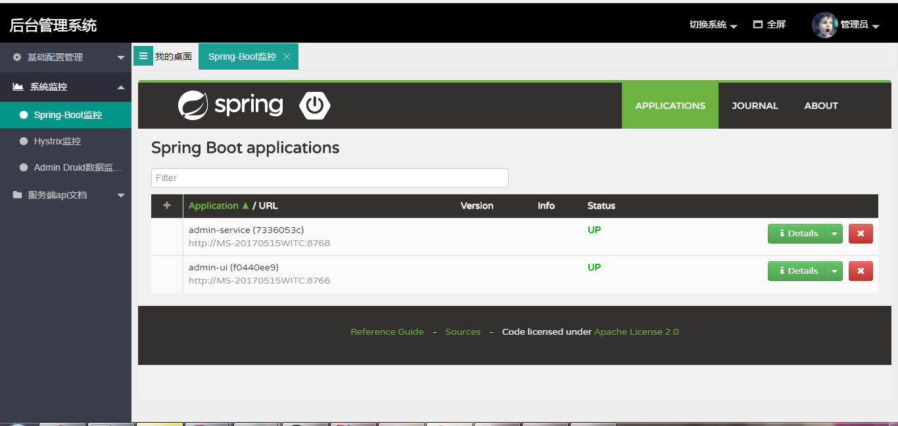

# Admin-Cloud-System
Admin-Cloud-System是基于Spring Cloud微服务架构实现的前后台分离管理信息系统，具备用户管理、角色管理、菜单管理、代码生成器、监控等多个模块，支持多业务系统并行开发，可以作为中小企业后台管理系统使用。代码简洁，架构清晰，适合有一定JAVA基础的同学学习，或者直接项目中使用。核心技术采用Eureka、Fegin、Ribbon、Zuul、Hystrix、Security、OAth、Mybatis、Redis等主要框架和中间件，前端采用Layui、Bootstrap组件。


学习交流QQ群号：64280922


## 架构图


------

## 项目结构
``` lua
├─admin-sysem-cloud
│  │
│  ├───────────admin-service----------------后台服务层
│  │
│  ├───────────admin-gate-----------------服务网关负载中心
│  │
│  ├───────────admin-ui-------------------前端界面层
│  │
│  ├───────────admin-center---------------服务注册中心
│  │
│  ├───────────admin-monitor--------------实时监控中心
│  │
│  └───────────admin-api------------------公共服务接口层

``` 
------------
## 功能简介

> 我的桌面

系统首页，包括快捷键功能、数据图表展示、待办事项、系统监控展示、系统版本信息等功能，支持全屏操作，支持多系统切换。

> 用户管理

对用户的基本信息进行管理。

> 菜单管理

对菜单的基本信息进行管理，包括菜单地址、对应功能模块中的操作权限进行管理

> 角色管理

对角色信息进行管理，对用户进行菜单权限的绑定

> 操作日志

每操作一步增加、删除、修改等操作，系统会记录一条日志，方便在前台进行展示

> 代码生成器

基于数据库表模型生成对应的增删改查代码，重启应用之后，配置菜单即可访问，对于表字段是否在前台展示、是否可以编辑、查询条件等均可在前台配置完成。

> Spring-Boot监控

基于Spring Boot Admin监控功能，对系统中的微服务进行监控

> Hystrix监控

基于Spring Cloud Hystrix监控功能，对系统中的微服务进行监控

> Admin Druid数据监控

对数据库运行情况进行监控，包括sql运行时间，数据库性能等信息

> Admin Rest API

Rest服务可视化


------------

## 启动指南

### 必用工具
- idea开发工具
- mysql数据库一个，redis数据库一个
- jdk1.8
- IDE插件一个，lombok插件，具体百度即可

### 运行步骤
- 运行数据库脚本：admin-sysem-cloud/project-bootstrap/admin_cloud_db.sql
- 修改数据库配置：admin-service/src/main/resources/application.yml、generator.properties
- 依次运行main类：CenterBootstrap（admin-center）、AdminBootstrap（admin-service）、UIBootstrap（admin-ui）、GateBootstrap（admin-gate）、MonitorBootstrap（admin-monitor）
- 访问地址: http://localhost:8765/login  账号/密码：admin/admin

---------

## 系统截图





